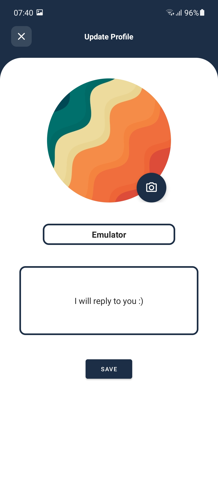
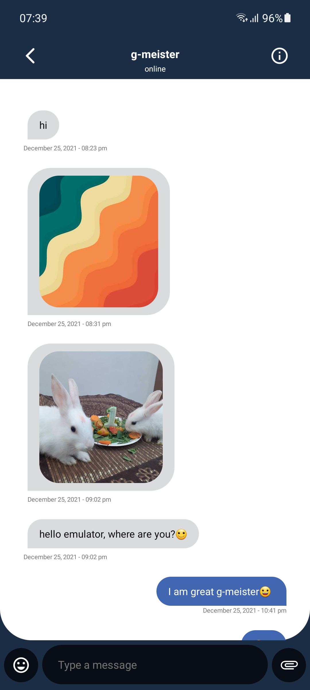
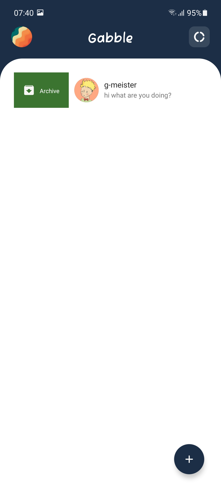
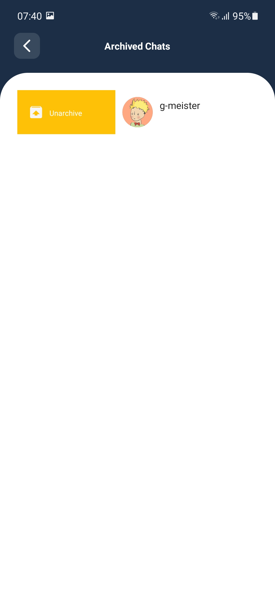
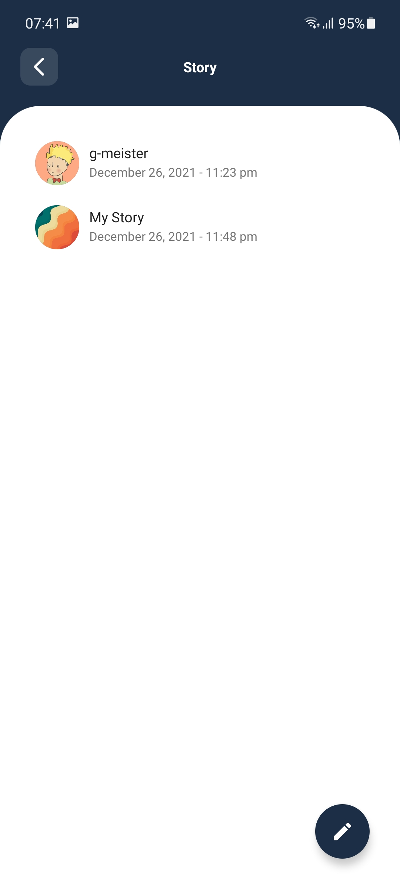
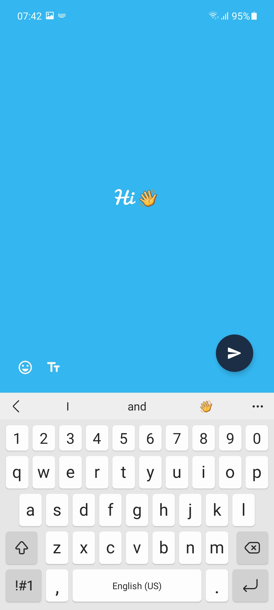
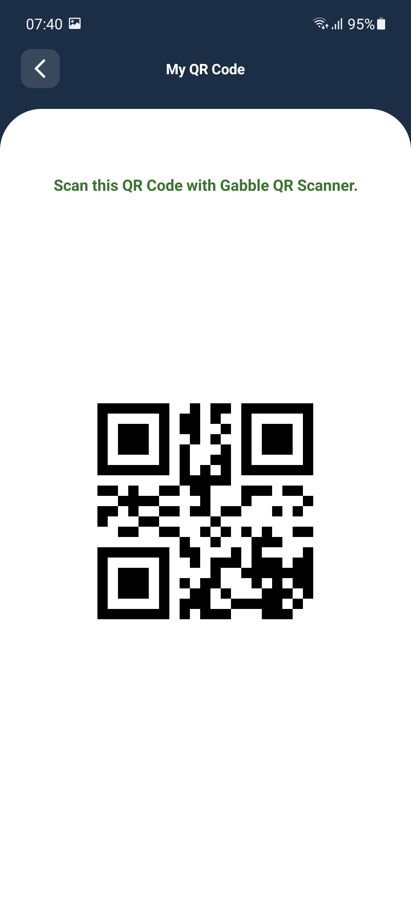
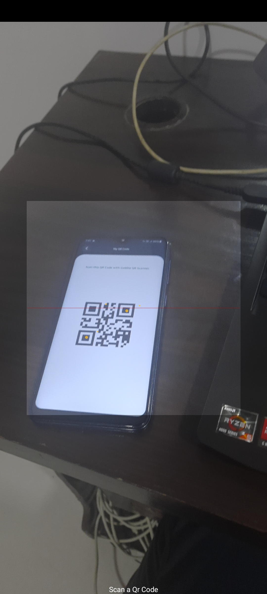

 
  

<h2 align="center"> Gabble - Chat Application </h2>
Gabble is a chat Application which allows users to send text messages, voice messages, and share images, documents, and other content. This is Droidrush Repository of g-meister Team (Avishkar 2021- Annual Techfest of MNNIT Allahabad).
  

**Project Presentation** : [View Here]() 
**App's APK** : [Download](https://drive.google.com/file/d/13E8oy88eeIDSzDKju9UEpVDzVPm2Bh0S/view?usp=sharing)

### THE PROCESS FLOW

1. Login/Sign up(phone verification required).
2. Create/ edit your own profile.
3. Chat with other users using gabble.
4. Post stories containing rich text for 24 hours.
5. Archive not so important chats.
6. Online status of the users can be seen.
7. Typing status of the user is seen while he is typing some text.
8. View other user's profile.
9. Send Images/Contacts to other users.
10. Scan other user's Gabble QR to directly chat with him.

### APIs and Components used
- Firebase Firestore Database
- Firebase Storage
- Firebase Authentication
- Intuit sdp (Support for different screen sizes)
- Rounded Image View
- WasaBeef Rich Editor (Rich Text Support)
- VannikTech Emoji Material (for emoji keyboard)
- Slidr (for slidable activity)
- RecyclerViewSwipeDecorator (for adding swipe actions in list) 
- ViewPager 2
- Glide (for efficient image loading)
- QRGenerator (for QR code support)
- ZXing Android Embedded (for Scanning and processing QR codes)
- AndroidX artifacts with Google Material Design components

### Team : g-meister
**Members:** 
1. [Gautom Agarwal](https://github.com/gautom5987)

### To try hands on the project
Either, just download the APK  and try it out; OR :  
1. CLone the project using link: https://github.com/gautom5987/gabble.git
2. Import the Project in Android Studio
3. Deploy the app to your android device and you are good to go! 

#### User profile and chat

  

#### Archive and Unarchive chats

 

#### View Stories and Create Story

 

#### QR code based Chat to me

 

 
